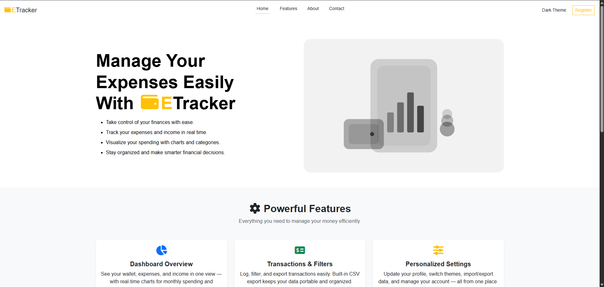
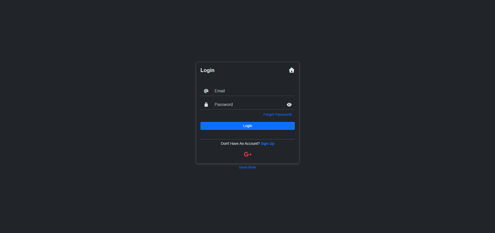
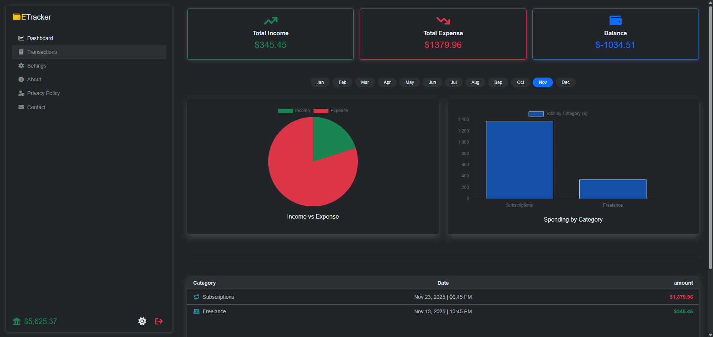
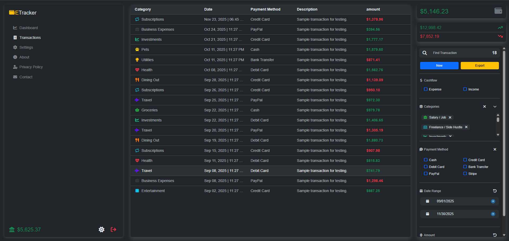
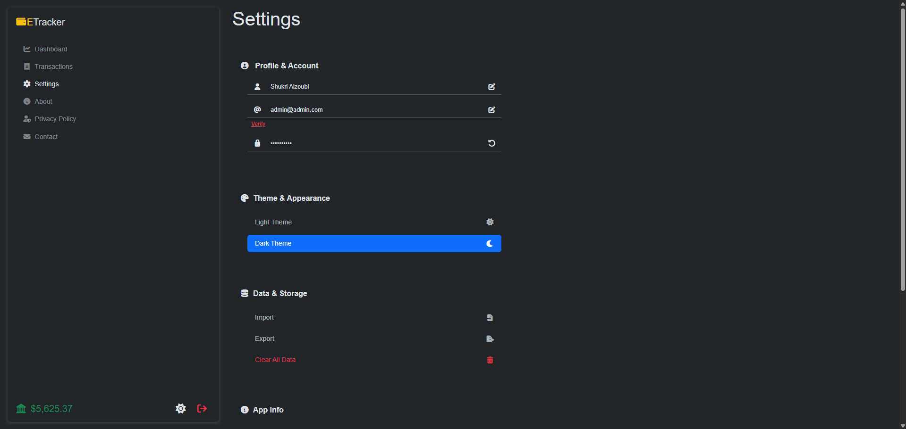

# 💰 Expense Tracker (Vite + React + Firebase)

A modern **Expense Tracker App** built with **Vite**, **React**, and **Firebase** to help you manage your personal finances with ease.  
Track your daily spending, visualize monthly expenses, and keep your data safe in the cloud.

---

## 🚀 Features

✅ **Firebase Firestore** – Secure cloud storage for all transactions  
✅ **Firebase Authentication** – Sign up, log in, and manage your account safely  
✅ **Add / Edit / Delete Transactions** – Full CRUD functionality for your expenses and income  
✅ **Import & Export (CSV / JSON)** – Easily back up or move your financial data  
✅ **Monthly Charts** – Interactive visualizations of your spending habits  
✅ **Totals & Filters** – View summaries and filter transactions by category, date, or type  

---

## 🧩 Tech Stack

- ⚡ **Vite** – Fast development and build tool  
- ⚛️ **React 18** – Component-based UI  
- 🔥 **Firebase** – Authentication & Firestore Database  
- 📊 **Chart.js** – Data visualization  
- 🧮 **PapaParse / FileSaver.js** – CSV and JSON import/export  

---

## 🗂️ Project Structure

```bash
react-expense-tracker/
├── src/
│   ├── components/
│   │   ├── dashboard/
│   │   ├── forms/
│   │   ├── layout/
│   │   ├── routing/
│   │   └── ui/
│   ├── context/
│   │   └── dialogs/
│   ├── data/
│   ├── firebase/
│   ├── hooks/
│   ├── models/
│   ├── pages/
│   │   └── auth/
│   ├── utils/
│   ├── App.jsx
│   └── main.jsx
├── public/
├── package.json
└── vite.config.js
```

---

## ⚙️ Setup Instructions

1. **Clone the repository**
   ```bash
   git clone https://github.com/shukri-alzoubi/react-expense-tracker.git
   cd expense-tracker
   ```

2. **Install dependencies**
   ```bash
   npm install
   ```

3. **Setup Firebase**
   - Create a Firebase project  
   - Enable **Authentication (Email/Password)**  
   - Create a **Firestore Database**  
   - Add your Firebase configuration to `/src/firebase/config.js`

   ```js
   // src/firebase/config.js
   import { initializeApp } from "firebase/app";

   const firebaseConfig = {
     apiKey: "YOUR_API_KEY",
     authDomain: "YOUR_AUTH_DOMAIN",
     projectId: "YOUR_PROJECT_ID",
     storageBucket: "YOUR_STORAGE_BUCKET",
     messagingSenderId: "YOUR_SENDER_ID",
     appId: "YOUR_APP_ID",
   };

   export const app = initializeApp(firebaseConfig);
   ```

4. **Run the development server**
   ```bash
   npm run dev
   ```

---

## 📈 App Features Overview

### 🔐 Authentication
- Register and log in using Firebase Auth.
- Protect routes for logged-in users only.

### 💵 Transactions
- Add income and expense entries.
- Edit or delete existing transactions.

### 📤 Import & Export
- Export data to CSV or JSON.
- Import previously saved files to restore your data.

### 📊 Analytics
- Monthly charts to visualize expenses vs income.
- Filter by category, date, or amount range.
- Total summary of balance, income, and expenses.

---

## 🧾 Scripts

| Command | Description |
|----------|--------------|
| `npm run dev` | Start development server |
| `npm run build` | Build for production |
| `npm run preview` | Preview production build |

---

## 🌐 Demo
[Live Demo Link](https://react-expense-tracker-sma.web.app/register)

---

## 🌟 Screenshots








---

## 🛡️ License
This project is licensed under the [MIT License](LICENSE).

---

### ✨ Made with ❤️ using React + Vite + Firebase
