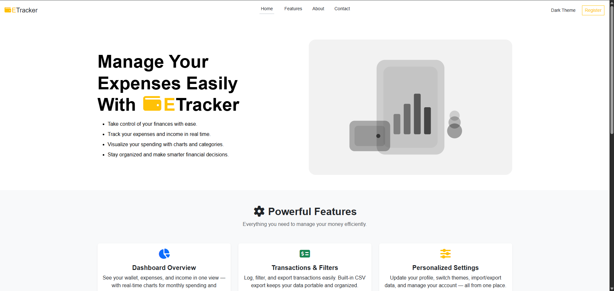

# Expense Tracker

A **React.js** application to track personal expenses. Users can add, edit, and delete transactions, and view summaries of their spending. Designed with **Bootstrap** for a responsive, mobile-first interface.

## Features
- Add, edit, and delete transactions
- View expense summaries and totals
- Responsive design using Bootstrap grid and cards
- Firebase integration for persistent storage

## Tech Stack
- React.js
- Bootstrap 5
- Firebase (Realtime Database or Firestore)
- JavaScript (ES6+)

## Installation
1. Clone the repo: `git clone https://github.com/yourusername/react-expense-tracker.git`
2. Install dependencies: `npm install`
3. Run the app: `npm start`

## Usage
- Open the app in the browser
- Add new transactions using the input form
- Edit or delete existing transactions
- See expense totals updated dynamically

## Demo
[Live Demo Link](https://react-expense-tracker-sma.vercel.app)

## Screenshots

## Author
- Shukri Alzoubi
